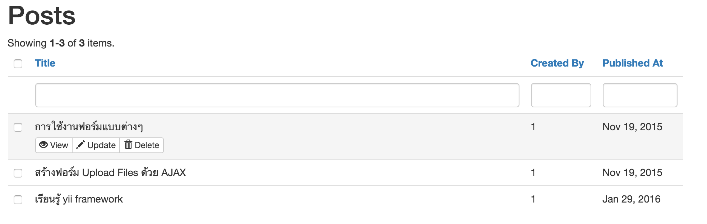
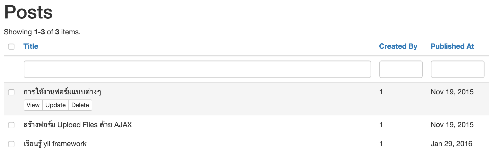
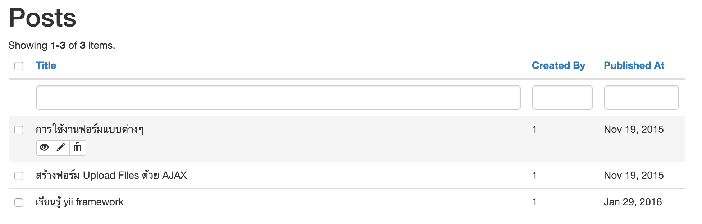
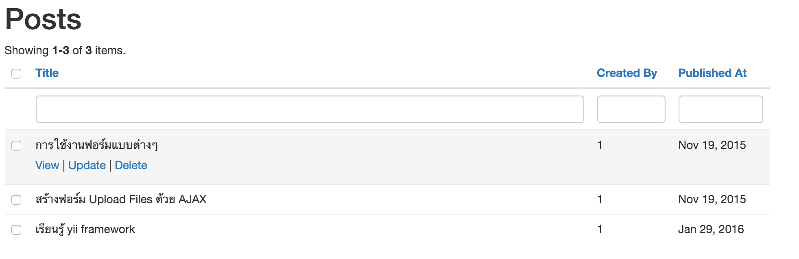
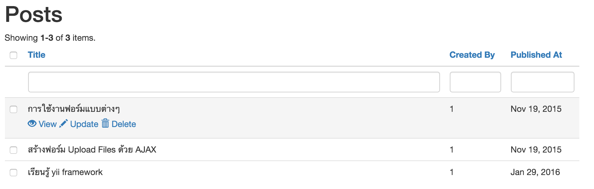
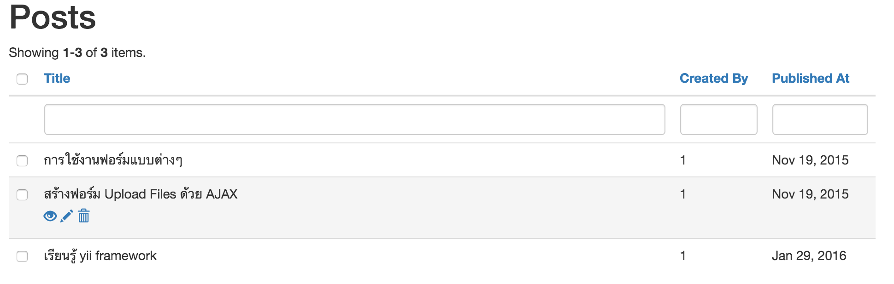

Yii2 Title Action
=================
Action column for gridview

Installation
------------

The preferred way to install this extension is through [composer](http://getcomposer.org/download/).

Either run

```
php composer.phar require --prefer-dist dixonstarter/yii2-title-action "*"
```

or add

```
"dixonstarter/yii2-title-action": "*"
```

to the require section of your `composer.json` file.


Usage
-----

Once the extension is installed, simply use it in your code by  :

```php
<?= GridView::widget([
    'dataProvider' => $dataProvider,
    'filterModel' => $searchModel,
    'tableOptions'=>['class'=>'table table-hover'],
    'columns' => [
        [
          'attribute'=>'title',
          'linkStyle'=>'buttongroup', // default, buttongroup
          'labelStyle'=>'iconText' // icon,text,iconText
          'class'=>'\dixonstarter\grid\TitleActionColumn',
        ],
    ],
]); ?>

```












